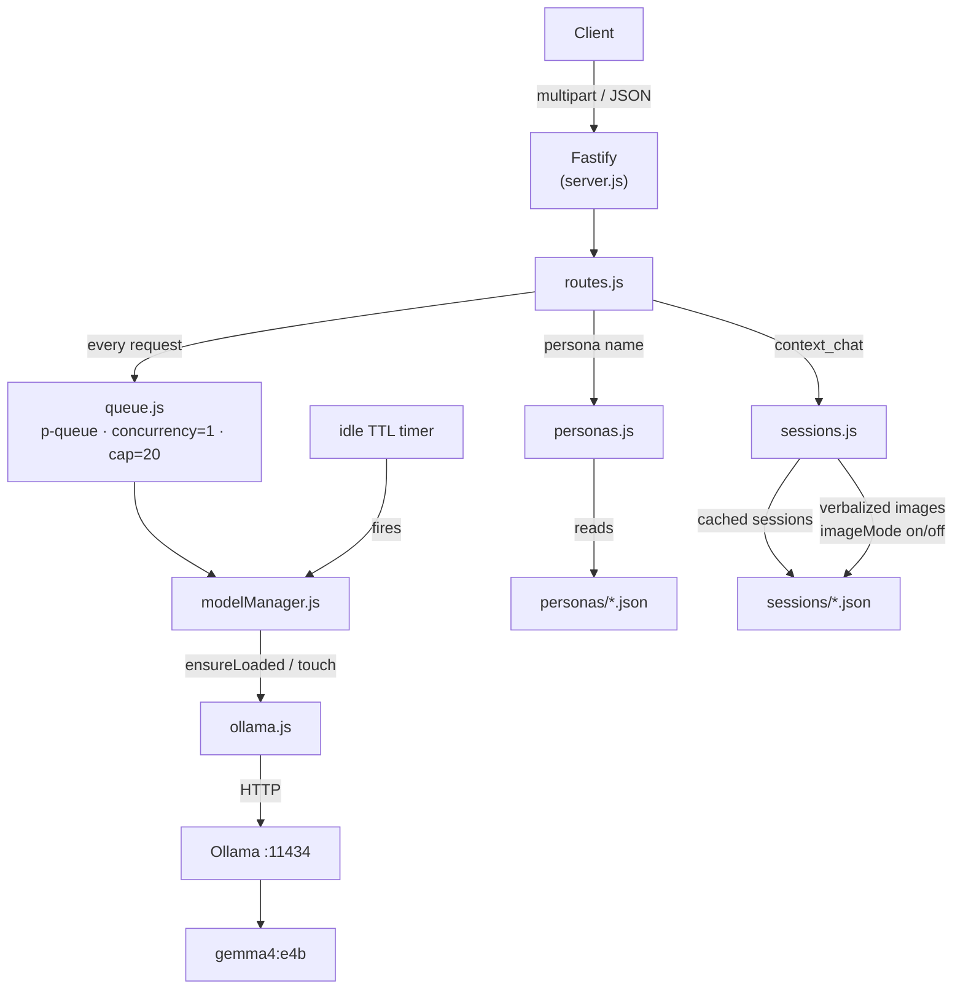
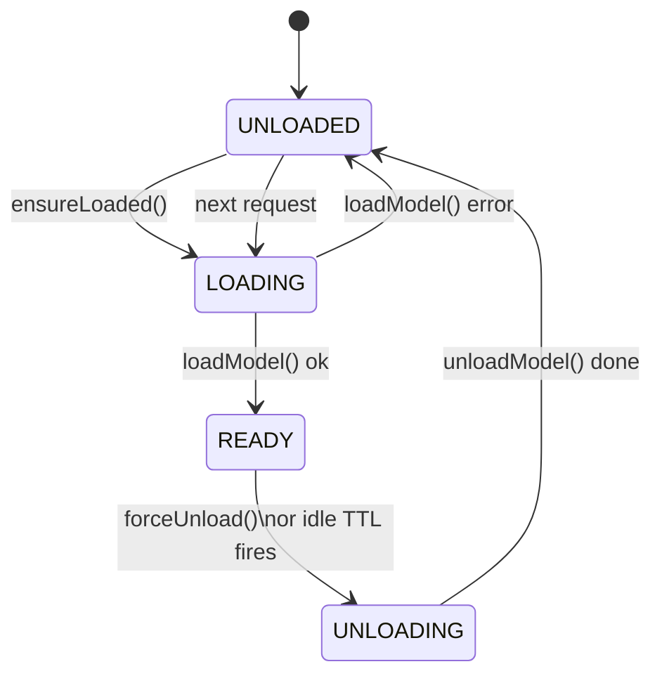

# gemma-gateway

A resident Fastify process that proxies text, image, and audio requests to a
local Gemma 4 model running in Ollama. The model is booted on first request,
kept alive for a configurable TTL, and unloaded when idle. Requests beyond the
concurrency limit queue up instead of choking Ollama.

Stateful conversation is supported via `/context_chat`, which manages session
history automatically — including transparent compression via summarisation when
the context window fills up, multi-turn image context via verbalization, and
per-session persona assignment.

---

## Prerequisites

- Node.js 20+
- [Ollama](https://ollama.com) installed and running
- `ollama pull gemma4:e4b` (or whichever model you set in `.env`)
- PM2 installed globally: `npm install -g pm2`

---

## Setup

```bash
npm install
cp .env .env.local   # tweak if needed
```

Key `.env` knobs:

| Variable                      | Default    | Meaning                                                   |
|-------------------------------|------------|-----------------------------------------------------------|
| `OLLAMA_MODEL`                | gemma4:e4b | Which model tag to use                                    |
| `MODEL_KEEP_ALIVE_SECONDS`    | 300        | Ollama keeps model in VRAM for this long                  |
| `IDLE_TTL_SECONDS`            | 360        | Server unloads model after this much inactivity           |
| `QUEUE_CONCURRENCY`           | 1          | Parallel requests sent to Ollama                          |
| `QUEUE_MAX_SIZE`              | 20         | Max queued requests before 429                            |
| `SESSION_CACHE_DIR`           | sessions/  | Directory where cached session files are stored           |
| `MODEL_CONTEXT_TOKENS`        | 131072     | Model context window in tokens (128K for gemma4:e4b)      |
| `CONTEXT_SUMMARIZE_THRESHOLD` | 70         | % of context window that triggers history summarisation   |
| `CONTEXT_SUMMARY_KEEP_RECENT` | 10         | Recent raw turns kept verbatim during summarisation       |
| `PERSONAS_DIR`                | personas/  | Directory containing persona JSON files                   |
| `DEFAULT_PERSONA`             | default    | Persona used when none is specified in the request        |

---

## Running

### Development (auto-restart on file change)
```bash
npm run dev
```

### Tests
```bash
npm test
```

See [README-tests.md](README-tests.md) for a full description of the test suite.

### Production via PM2
```bash
npm run pm2:start          # start
npm run pm2:logs           # tail logs
npm run pm2:monit          # live dashboard
npm run pm2:restart        # rolling restart
npm run pm2:stop           # stop

# persist across reboots
pm2 save
pm2 startup                # follow the printed instruction
```

---

## API

### GET /status
```bash
curl http://localhost:3000/status | jq
```
```json
{
  "model":    { "state": "ready", "idleTtlSeconds": 360, "idleTimerActive": true },
  "queue":    { "pending": 0, "running": 1, "concurrency": 1, "maxSize": 20 },
  "personas": ["concise", "default", "friendly"]
}
```

---

### POST /chat — stateless text prompt

Context is managed entirely by the caller via the optional `history` array.
For automatic context management use `/context_chat` instead.

```bash
curl http://localhost:3000/chat \
  -H 'Content-Type: application/json' \
  -d '{"prompt": "Explain the difference between TCP and UDP in two sentences."}' \
  | jq '.reply'
```

With a persona and inference options:
```bash
curl http://localhost:3000/chat \
  -H 'Content-Type: application/json' \
  -d '{
    "prompt":  "Explain recursion.",
    "persona": "concise",
    "options": { "temperature": 0.4 }
  }' | jq '.reply'
```

---

### POST /chat/stream — streaming SSE
```bash
curl -N http://localhost:3000/chat/stream \
  -H 'Content-Type: application/json' \
  -d '{"prompt": "Write a haiku about distributed systems."}'
```
Each event:  `data: {"token":"..."}`
Final event: `data: [DONE]`

---

### POST /imagine — stateless image understanding
```bash
curl http://localhost:3000/imagine \
  -F 'image=@/path/to/photo.jpg' \
  -F 'prompt=What objects are visible in this image?' \
  | jq '.reply'
```

Default prompt (omit `-F prompt`) is `"Describe this image."` Optionally pass
`-F 'persona=concise'` to control tone.

---

### POST /transcribe — audio transcription
```bash
curl http://localhost:3000/transcribe \
  -F 'audio=@/path/to/recording.wav' \
  -F 'prompt=Transcribe this audio accurately.' \
  | jq '.reply'
```

Supported formats: WAV, MP3, FLAC, OGG.

---

### POST /unload — evict model immediately
```bash
curl -X POST http://localhost:3000/unload
```
Useful before a long idle period to free memory.

---

### GET /personas — list available personas
```bash
curl http://localhost:3000/personas | jq
```
```json
{ "personas": ["concise", "default", "friendly"], "default": "default" }
```

---

### POST /context_chat — stateful chat

Maintains conversation history server-side. Always use multipart form data,
even for text-only turns. On first call a session is created and a `uid`
returned; subsequent calls pass that `uid` to resume.

History is persisted to disk by default so sessions survive server restarts.
When history fills the context window, the oldest turns are compressed inline
via summarisation. Images uploaded during a session are verbalized on first
upload and their descriptions carried in history for subsequent turns.

**New session — text only:**
```bash
curl http://localhost:3000/context_chat \
  -F 'prompt=My name is Alex and I am debugging a Rust async runtime.' \
  | jq
```
```json
{
  "uid":           "3f2a1b...",
  "reply":         "Hello Alex! What aspect of the async runtime are you looking into?",
  "context_usage": 2
}
```

**Resume a session:**
```bash
curl http://localhost:3000/context_chat \
  -F 'prompt=What is my name?' \
  -F 'uid=3f2a1b...' \
  | jq '.reply'
```

**New volatile session (in-memory only, lost on restart):**
```bash
curl http://localhost:3000/context_chat \
  -F 'prompt=Hello' \
  -F 'cache=false' \
  | jq
```
A `notice` field in the response confirms the session is volatile.

**With a persona:**
```bash
curl http://localhost:3000/context_chat \
  -F 'prompt=Explain async/await in Rust.' \
  -F 'persona=concise' \
  | jq '.reply'
```

**Request fields:**

| Field        | Type    | Required | Default | Description                                       |
|--------------|---------|----------|---------|---------------------------------------------------|
| `prompt`     | string  | yes      | —       | The user's message                                |
| `uid`        | string  | no       | —       | Session ID to resume; 404 if not found            |
| `cache`      | string  | no       | `true`  | `'true'` or `'false'` — persist session to disk   |
| `persona`    | string  | no       | —       | Persona name; 424 if file not found               |
| `options`    | string  | no       | —       | JSON-encoded inference params, e.g. `'{"temperature":0.3}'` |
| `image`      | file    | no       | —       | Triggers image verbalization pipeline             |
| `image_mode` | string  | no       | —       | `'on'` or `'off'` — toggle image-awareness        |

**Response fields:**

| Field           | Type   | Description                                                  |
|-----------------|--------|--------------------------------------------------------------|
| `uid`           | string | Session ID — pass back on every subsequent turn              |
| `reply`         | string | The model's response                                         |
| `context_usage` | number | 0–100% of the summarisation threshold consumed               |
| `image_context` | object | Present when session has verbalized images (see below)       |
| `verbalized`    | string | Filename of the image just verbalized, when an image was uploaded this turn |
| `notice`        | string | Present only on new volatile sessions                        |

**`image_context` shape:**
```json
{
  "mode":   "on",
  "images": ["photo.jpg", "diagram.png"]
}
```
`mode: "on"` means the model is aware of the verbalized images and will offer to
re-examine them if it detects a reference without a fresh upload. `mode: "off"`
suppresses that behaviour while keeping the descriptions available in history.

---

### GET /context_chat/:uid — inspect session

```bash
curl http://localhost:3000/context_chat/3f2a1b... | jq
```
```json
{
  "uid":          "3f2a1b...",
  "cached":       true,
  "turns":        6,
  "hasSummary":   false,
  "contextUsage": 18,
  "images":       ["photo.jpg"],
  "imageMode":    "on",
  "createdAt":    1718000000000,
  "updatedAt":    1718000500000
}
```

`hasSummary: true` means at least one round of compression has occurred.
History content is never exposed by this endpoint.

---

### DELETE /context_chat/:uid — delete session

Removes the session from memory and from disk (if cached).

```bash
curl -X DELETE http://localhost:3000/context_chat/3f2a1b...
```
```json
{ "ok": true, "uid": "3f2a1b...", "deleted": true }
```

---

## Personas

Personas are JSON files in `personas/` that set the model's system prompt and
optionally override inference parameters. The filename (without `.json`) is the
persona name used in requests.

```json
{
  "description": "Terse technical assistant",
  "system":      "You are a concise technical assistant. Answer directly and briefly.",
  "options":     { "temperature": 0.3, "repeat_penalty": 1.1 }
}
```

Only `system` and `options` are used at runtime; `description` is ignored.
`options` are overridable per-request — request-level `options` take precedence
over persona `options`. Three starter personas ship with the project:
`default`, `concise`, and `friendly`.

A missing or malformed persona file returns **424 Failed Dependency** with a
descriptive error message.

---

## Image context in `/context_chat`

When an image is uploaded to a `/context_chat` turn, the gateway runs a
two-step pipeline before responding to the user's prompt:

1. **Verbalization** — the model is asked to describe the image in detail. The
   description is stored in the session under the original filename and appended
   to history as `[image: filename.jpg]\n<description>`. The raw image is not
   retained between turns.

2. **Direct vision on upload turn** — the raw image is also attached to the
   current inference, so the model both sees the image directly *and* has the
   description in its history for future turns.

On subsequent text-only turns the model works from the description. If it
detects that the user is referring to an image but none has been uploaded to
the current turn, it will acknowledge the description is available and suggest
re-uploading if direct examination is needed. This behaviour is prompt-guided
and best-effort — it works well in practice but cannot be asserted
deterministically.

Re-uploading the same filename replaces the stored description. `image_mode`
is automatically set to `'on'` whenever an image is added, and can be turned
`'off'` by the caller to suppress image-awareness in the system prompt while
leaving descriptions intact in history.

---

## Context management and summarisation

Each `context_chat` session accumulates turns as `{role, content}` objects.
After every exchange, the server estimates the token count of the full history
(using a ~4 chars/token heuristic for the Gemma family) and compares it against
`CONTEXT_SUMMARIZE_THRESHOLD` percent of `MODEL_CONTEXT_TOKENS`.

When the threshold is crossed, the server runs a summarisation pass **inline**
before returning a response:

1. The most recent `CONTEXT_SUMMARY_KEEP_RECENT` raw turns are kept verbatim.
2. All older raw turns are sent to the model with a compression prompt.
3. The result replaces those turns as a single `role: "summary"` turn at the head
   of the history.
4. Any existing summary turn is incorporated into the new one — there is always
   at most one summary turn in a session.

The `context_usage` value resets to a lower percentage after compression.

---

## Architecture



**State machine (ModelManager):**



The idle timer fires after `IDLE_TTL_SECONDS` of no `touch()` calls, which
drives the `READY → UNLOADING → UNLOADED` transition.
